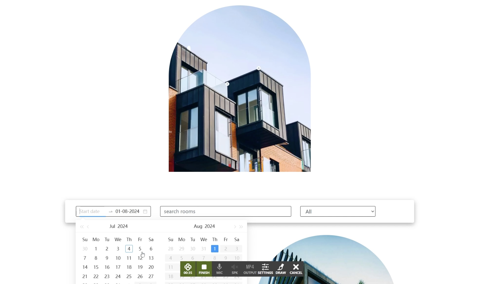
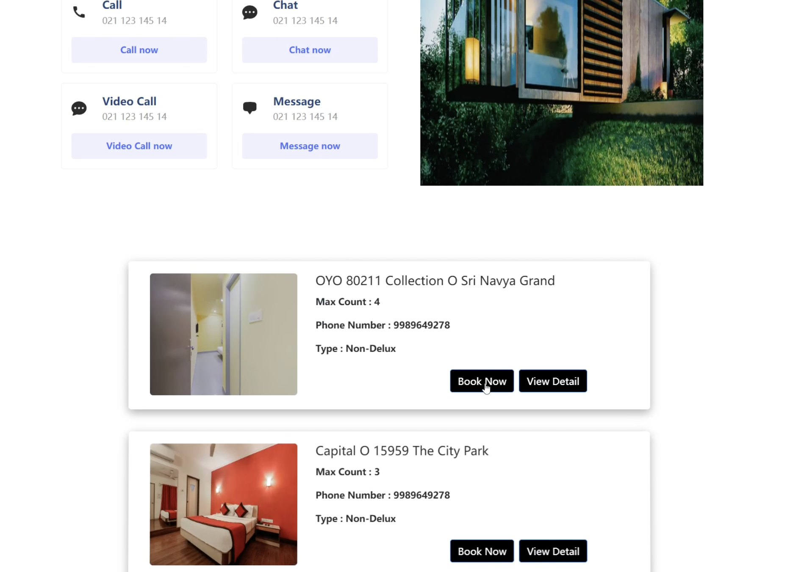
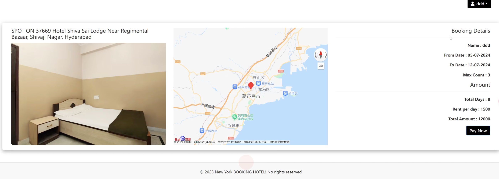
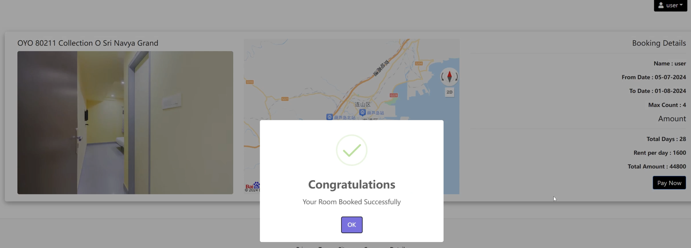
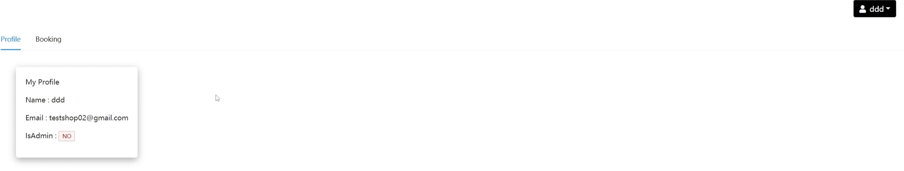
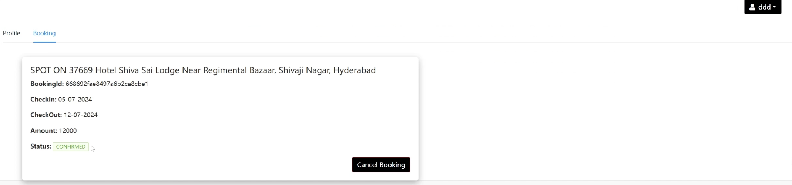

# RoomBooking-App
### 1. Introduction
#### This is a MERN stack booking website like Airbnb with frontend and backend seperation. 
* Environment: Node.js
* Front-end : React.js
* Back-end: Express.js
* Database: MongoDB
### 2. Demo
* [Video Demo - guests](https://www.youtube.com/watch?v=GyCaTYoBsdo&t=14s)
* [Video Demo - hosts](https://www.youtube.com/watch?v=YfQ3RN2fCbU)
### 3. Function
* Search for rooms
  
* Results of searching
  
* Room details including location on the map
  
* Payment
  
* Profile of a guest
  
  
