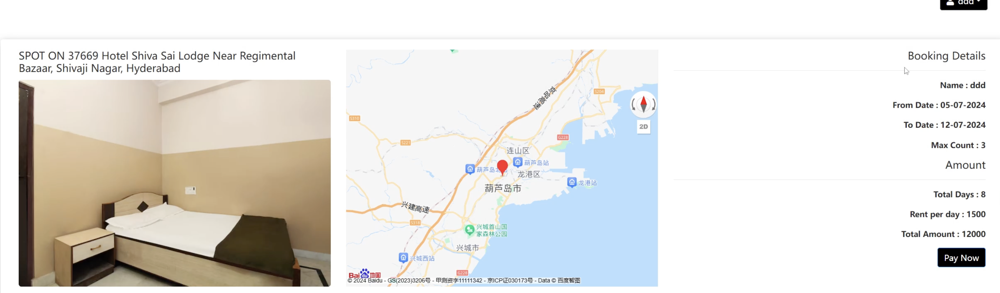
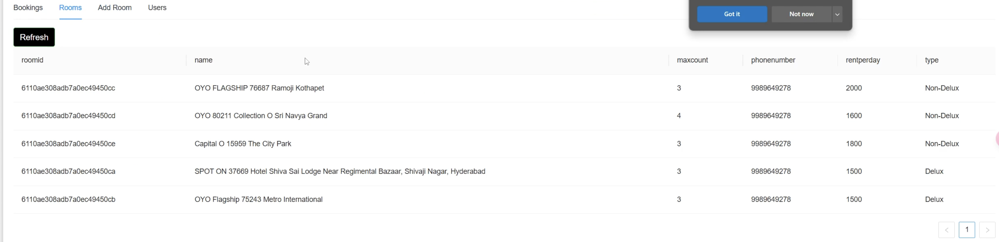
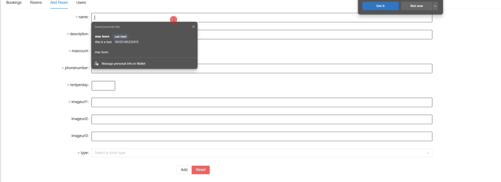

# RoomBooking-App
### 1. Introduction
#### This is a MERN stack booking website like Airbnb with frontend and backend seperation. 
* Environment: Node.js
* Front-end : React.js
* Back-end: Express.js
* Database: MongoDB
### 2. Function Examples
* Search for rooms
  

  
* Results of searching
  

  
* Room details including location on the map
  

  
* Payment
  

  
* Profile of a guest
  
  

* Hosts view their rooms posted
  

* Hosts add a new room
  
